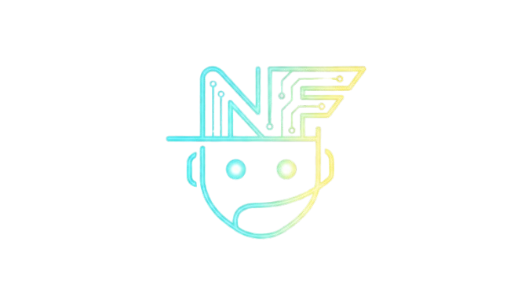

<p align="center">
  
</p>

# SSD NEA FLOW

**Orquestacion de equipos de agentes con sub-agentes IA**

> Un orquestador + sub-agentes especializados para desarrollo estructurado.
> Cero dependencias. Solo Markdown. Funciona en cualquier lugar.

Version: 2.0.2

Links rapidos: [Instalacion](#instalacion) • [Herramientas](#herramientas) • [Documentacion tecnica](#documentacion-tecnica)

## Indice

- [El problema](#el-problema)
- [La solucion](#la-solucion)
- [Que es](#que-es)
- [Arquitectura en breve](#arquitectura-en-breve)
- [Documentacion tecnica](#documentacion-tecnica)
- [Flujo nea-flow](#flujo-nea-flow)
- [Requisitos](#requisitos)
- [Estructura del repo](#estructura-del-repo)
- [Instalacion](#instalacion)
- [Herramientas](#herramientas)
- [Persistencia de artefactos](#persistencia-de-artefactos)
- [Skills adicionales](#skills-adicionales)
- [Troubleshooting](#troubleshooting)
- [Contribuir](#contribuir)

## El problema

Los asistentes de codigo son potentes, pero fallan en features complejas:

- Context overload: conversaciones largas llevan a compresion, perdida de detalles y alucinaciones
- No structure: "Build me dark mode" produce resultados impredecibles
- No review gate: se escribe codigo antes de acordar que se va a construir
- No memory: las specs viven en el chat y se pierden

## La solucion

NEA Flow es un patron de orquestacion de equipos de agentes donde un
coordinador liviano delega el trabajo a sub-agentes especializados. Cada
sub-agente inicia con contexto fresco, ejecuta una tarea puntual y devuelve
un resultado estructurado.

Insight clave: el orquestador no deberia hacer trabajo pesado de fases
directamente. Coordina, mantiene estado y sintetiza resultados.

## Que es

Plantilla base agnostica de editor para operar un flujo SDD (Spec-Driven
Development) con skills de `nea-flow` y artefactos OpenSpec. Incluye:

- skills por fase
- prompts y configuraciones por herramienta
- scripts de instalacion
- documentacion tecnica para maintainers en `ai/`

## Arquitectura en breve

```text
Usuario
  -> Orquestador
     -> sub-agentes por fase
     -> artefactos OpenSpec
```

Principios:

- contexto minimo en el hilo principal
- delegacion cuando leer o escribir infla demasiado el contexto
- artefactos persistidos para no depender del chat
- validacion fase por fase

Para la explicacion completa, lee:

- [`ai/architecture.md`](ai/architecture.md)
- [`ai/flow.md`](ai/flow.md)
- [`ai/persistence.md`](ai/persistence.md)
- [`ai/sub-agents.md`](ai/sub-agents.md)

## Documentacion tecnica

La carpeta [`ai/`](ai/README.md) concentra la referencia tecnica para
maintainers y contribuidores.

Mapa recomendado:

- [`ai/README.md`](ai/README.md) - indice general
- [`ai/architecture.md`](ai/architecture.md) - arquitectura del patron
- [`ai/concepts.md`](ai/concepts.md) - vocabulario y convenciones
- [`ai/flow.md`](ai/flow.md) - fases y reglas del flujo
- [`ai/persistence.md`](ai/persistence.md) - OpenSpec y artefactos
- [`ai/sub-agents.md`](ai/sub-agents.md) - modelo de sub-agentes por herramienta
- [`ai/token-economics.md`](ai/token-economics.md) - estimado de economia de tokens
- [`ai/authoring.md`](ai/authoring.md) - guia para maintainers

## Flujo nea-flow

Comandos del flujo:

- `/flow-nea-init`
- `/flow-nea-explore <change-name>`
- `/flow-nea-quick <change-name>`
- `/flow-nea-propose <change-name>`
- `/flow-nea-spec <change-name>`
- `/flow-nea-design <change-name>`
- `/flow-nea-tasks <change-name>`
- `/flow-nea-apply <change-name>`
- `/flow-nea-verify <change-name>`
- `/flow-nea-archive <change-name>`

Meta-comandos:

- `/flow-nea-ff <change-name>` - propone, especifica, disena y genera tareas en secuencia
- `/flow-nea-continue <change-name>` - reanuda desde la siguiente fase valida
- `/flow-nea-judgment <change-name>` - revision dual ciega en paralelo
- `/flow-nea-fix <change-name>` - relee fallos de verify y reintenta apply

Atajo de via rapida:

- `/flow-nea-quick <change-name>` - genera un blueprint minimo para fixes pequenos y de bajo riesgo

Dependencias del flujo:

```text
INIT -> EXPLORE -> PROPOSE -> SPEC ──┐
                                     ├──> TASKS -> APPLY -> VERIFY -> ARCHIVE
                             DESIGN ─┘

INIT/EXPLORE -> QUICK -> APPLY -> VERIFY -> ARCHIVE
```

Para reglas detalladas de avance, regresion y retries, lee
[`ai/flow.md`](ai/flow.md).

Usa `quick` solo cuando el cambio es pequeno, de bajo riesgo y no necesita
`proposal.md`, `specs/`, `design.md` ni `tasks.md`.

## Requisitos

- OpenCode, Gemini CLI, Codex, Claude Code o VS Code
- integracion del editor para prompts o skills
- PowerShell para scripts de instalacion en Windows

## Estructura del repo

- `skills/flow-nea-*/`: skills de cada fase del flujo
- `skills/judgment-day/`: revision dual ciega en paralelo
- `skills/skill-registry/`: indice compacto de skills
- `skills/skill-creator/`: bootstrap para crear nuevas skills
- `skills/_shared/`: contratos y reglas compartidas
- `examples/opencode/`: configuracion nativa multi-agente para OpenCode
- `examples/vscode/`: configuracion base para VS Code
- `examples/gemini-cli/`: configuracion base para Gemini CLI
- `examples/codex/`: configuracion base para Codex
- `examples/claude-code/`: configuracion base para Claude Code
- `scripts/`: instalacion automatizada
- `ai/`: referencia tecnica para maintainers

## Instalacion

Instalacion rapida:

```bash
git clone https://github.com/RDuuke/sdd-nea-flow.git
cd sdd-nea-flow
./scripts/install.sh
```

El instalador pregunta que herramienta usas y copia las skills al lugar correcto.

## Herramientas

| Herramienta | Modo | Setup base |
| --- | --- | --- |
| OpenCode | sub-agentes reales | instalar skills + `examples/opencode/AGENTS.md` + una variante JSON |
| Claude Code | sub-agentes reales | instalar skills + `commands/` + `examples/claude-code/CLAUDE.md` |
| Codex | orquestador + sub-agentes | instalar skills + `examples/codex/agents.md` |
| Gemini CLI | orquestador + sub-agentes | instalar skills + `examples/gemini-cli/GEMINI.md` |
| VS Code | prompts/contexto | instalar skills + `examples/vscode/copilot-instructions.md` |

Regla rapida:

- si quieres el modelo mas fiel al patron, usa OpenCode
- si quieres Anthropic CLI con delegacion real, usa Claude Code
- si quieres un flujo equivalente en Codex o Gemini, usa sus prompts de orquestador con el mismo patron por fase
- si quieres integrarlo en tu editor, usa VS Code

Referencias por herramienta:

- OpenCode: `examples/opencode/`
- Claude Code: `examples/claude-code/`
- Codex: `examples/codex/`
- Gemini CLI: `examples/gemini-cli/`
- VS Code: `examples/vscode/`

Verificacion minima en todos los casos:

```text
/flow-nea-init
```

## Persistencia de artefactos

OpenSpec es el backend recomendado. Los artefactos del flujo deben escribirse
en espanol, mientras que nombres de archivo y rutas se mantienen en ingles.

Estructura resumida:

```text
openspec/
├── config.yaml
├── specs/
└── changes/
    ├── {change-name}/
    │   ├── proposal.md
    │   ├── quick.md
    │   ├── specs/
    │   ├── design.md
    │   ├── tasks.md
    │   └── verify-report.md
    ├── .status.yaml
    └── archive/
```

Referencia completa: [`ai/persistence.md`](ai/persistence.md)

## Skills adicionales

- `judgment-day` - revision dual ciega en paralelo
- `skill-registry` - genera indice compacto de skills
- `skill-creator` - crea nuevas skills a partir de una descripcion

## Troubleshooting

Problemas comunes:

- comandos `/flow-nea-*` no aparecen -> revisa instalacion y reinicia la herramienta
- `.status.yaml` inconsistente -> elimina el archivo y usa `/flow-nea-continue`
- respuesta JSON incompleta -> reintenta la fase; el orquestador ya contempla un retry
- flujo bloqueado -> revisa `awaiting_approval` y `pending_tasks`

## Contribuir

PRs bienvenidos.

Guia corta:

1. cambia la skill, prompt o config que realmente gobierna el comportamiento
2. actualiza `ai/` si el cambio modifica arquitectura o reglas estables
3. actualiza `README.md` solo si afecta onboarding o uso

Para una guia mas detallada, lee [`ai/authoring.md`](ai/authoring.md).
